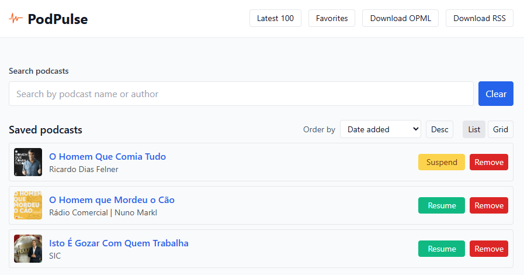
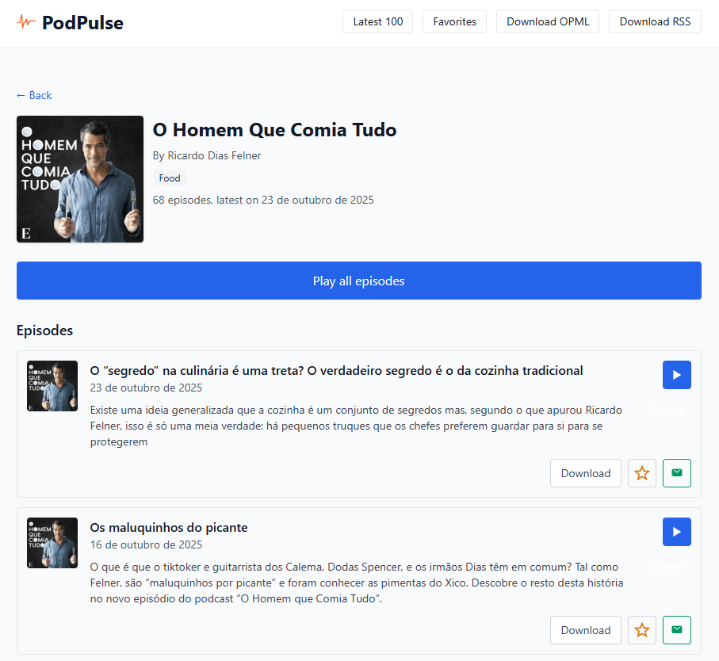

# PodPulse — Podcast Downloader & Player

This repository contains a small podcast manager: a React + Vite frontend and a FastAPI backend that stores podcasts and episodes in SQLite. It includes a global audio player, saved podcasts, favorites, watched state, and server-side helpers for downloading media.

## Screenshots





## Features

- Search iTunes (proxied via the backend) and save podcasts to the server
- Persist podcasts and episode metadata in SQLite
- Favorites and watched (listened) state persisted server-side
- Global audio player with play/pause/seek and "hide on stop"
- Single-episode download endpoint and a scheduler script to batch downloads

## Running the project (development)

Backend

1. Create a Python virtualenv and install dependencies:

```powershell
cd backend
python -m venv .venv
.\.venv\Scripts\Activate.ps1
pip install -r requirements.txt
```

2. Start the FastAPI backend (dev):

```powershell
uvicorn app.main:app --reload --port 8000
```

Frontend

1. Install dependencies and start the Vite dev server:

```powershell
cd frontend
npm install
npm run dev
```

The frontend uses `src/lib/api.js` to pick the backend base URL in development.

## Important API endpoints

All API routes are mounted under the `/api` prefix.

- `GET /api/podcasts` — list saved podcasts (includes `trackCount`).
- `POST /api/podcasts` — create/save a podcast. Body: { itunes_id, title, rss_url, ... }.
- `GET /api/podcasts/{podcast_id}` — get podcast details and its episodes (`items`).
- `PATCH /api/podcasts/{podcast_id}/suspend` — mark podcast suspended (suspended=1).
- `PATCH /api/podcasts/{podcast_id}/continue` — clear suspended flag (suspended=0).
- `DELETE /api/podcasts/{podcast_id}` — delete a podcast and all its items and favorites.
- `GET /api/podcasts/{podcast_id}/episodes` — list episodes (PodcastItem rows) for the specified podcast.

- `GET /api/itunes/search?q=...&limit=...` — proxy to iTunes Search API (returns simplified results used by the frontend).

- `GET /api/episodes` — list episodes across podcasts. Query params: `podcastId` (optional), `order` (`asc`|`desc`, default `desc`), `limit` (default 100).
- `GET /api/episodes/favorites` — list favorite entries; each favorite includes any matching `PodcastItem` rows under an `items` array.
- `POST /api/episodes/{item_id}/favorite` — mark the PodcastItem (by DB `item_id`) as favorite (server stores the external `track_id`).
- `DELETE /api/episodes/{item_id}/favorite` — remove favorite (by PodcastItem id).

- `GET /api/episodes/watched?podcastId={podcast_id}` — returns `{ "watched": [<external_track_id>, ...] }`. Optional `podcastId` filters to a single podcast.
- `POST /api/episodes/{item_id}/watched` — mark a PodcastItem (by DB `item_id`) as watched/listened.
- `DELETE /api/episodes/{item_id}/watched` — unmark watched for the given PodcastItem id.

- `GET /api/episodes/{item_id}/download` — serve a previously-downloaded media file for the PodcastItem (reads from the package `downloads/` directory).

## Developer notes

- Database models live in `backend/app/models.py`.
- Use functions in `backend/app/repository.py` for DB access (CRUD, mark downloaded, set filename).
- See `backend/schedule.py` for the canonical filename pattern and streaming logic used when storing downloaded media.

## UX & Implementation notes

- Global player: `AudioPlayerContext` + `useAudioPlayer()` provide play/stop/seek; `stop()` clears the `currentTrack` to hide the player.
- `PodcastSearch` saves podcasts via `POST /api/podcasts` and uses per-item saving indicators to avoid global loading UX issues.
- `Favorites` loads data from `/api/episodes/favorites` and normalizes `items` into episode rows, using optimistic UI on remove.

Contributions welcome — open issues or PRs with improvements.
