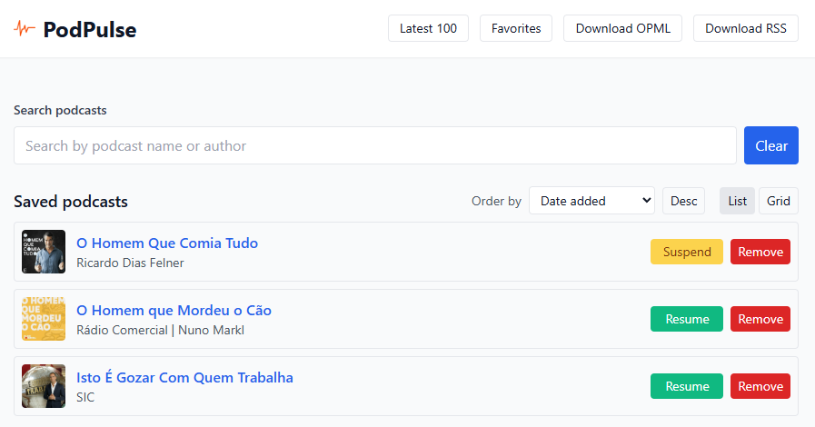
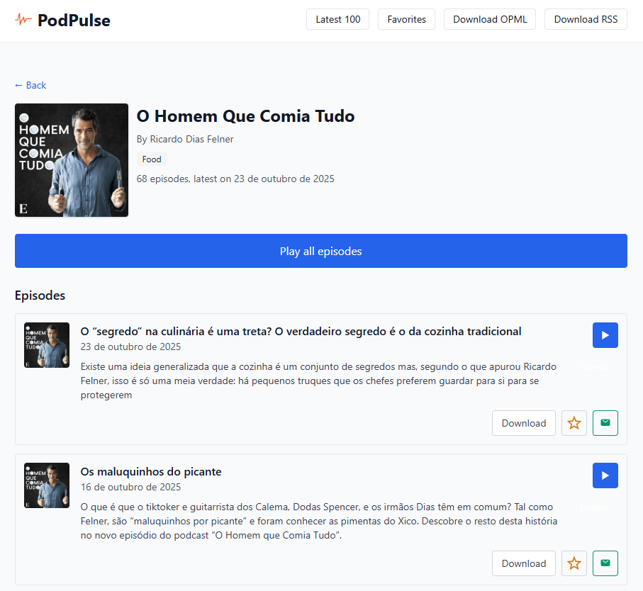

# PodPulse — Podcast Downloader & Player

This repository contains a small podcast manager: a React + Vite frontend and a FastAPI backend that stores podcasts and episodes in SQLite. It includes a global audio player, saved podcasts, favorites, watched state, and server-side helpers for downloading media.

> **⚠️ Security Notice**: This application is designed for personal/local use. It lacks authentication and has open CORS settings. See [Security Considerations](#security-considerations) before deploying to production.

## Screenshots





## Features

- Search iTunes (proxied via the backend) and save podcasts to the server
- Persist podcasts and episode metadata in SQLite
- Favorites and watched (listened) state persisted server-side
- Global audio player with play/pause/seek and "hide on stop"
- Single-episode download endpoint and a scheduler script to batch downloads

## Prerequisites

- **Python 3.12+** with pip
- **Node.js 18+** and npm
- **SQLite** (included with Python)
- **Operating System**: Windows, macOS, or Linux

## Running the project (development)

### Backend

1. Create a Python virtualenv and install dependencies:

**On Windows (PowerShell):**
```powershell
cd backend
python -m venv .venv
.\.venv\Scripts\Activate.ps1
pip install -r requirements.txt
```

**On Linux/macOS:**
```bash
cd backend
python3 -m venv .venv
source .venv/bin/activate
pip install -r requirements.txt
```

2. Start the FastAPI backend (dev):

```bash
uvicorn app.main:app --reload --port 8000
```

The backend will be available at `http://localhost:8000` with API documentation at `http://localhost:8000/docs`.

### Frontend

1. Install dependencies and start the Vite dev server:

```bash
cd frontend
npm install
npm run dev
```

The frontend uses `src/lib/api.js` to pick the backend base URL in development. Default is `http://localhost:5173`.

## Important API endpoints

All API routes are mounted under the `/api` prefix.

- `GET /api/podcasts` — list saved podcasts (includes `trackCount`).
- `POST /api/podcasts` — create/save a podcast. Body: { itunes_id, title, rss_url, ... }.
- `GET /api/podcasts/{podcast_id}` — get podcast details and its episodes (`items`).
- `PATCH /api/podcasts/{podcast_id}/suspend` — mark podcast suspended (suspended=1).
- `PATCH /api/podcasts/{podcast_id}/continue` — clear suspended flag (suspended=0).
- `DELETE /api/podcasts/{podcast_id}` — delete a podcast and all its items and favorites.
- `GET /api/podcasts/{podcast_id}/episodes` — list episodes (PodcastItem rows) for the specified podcast.

- `GET /api/itunes/search?q=...&limit=...` — proxy to iTunes Search API (returns simplified results used by the frontend).

- `GET /api/episodes` — list episodes across podcasts. Query params: `podcastId` (optional), `order` (`asc`|`desc`, default `desc`), `limit` (default 100).
- `GET /api/episodes/favorites` — list favorite entries; each favorite includes any matching `PodcastItem` rows under an `items` array.
- `POST /api/episodes/{item_id}/favorite` — mark the PodcastItem (by DB `item_id`) as favorite (server stores the external `track_id`).
- `DELETE /api/episodes/{item_id}/favorite` — remove favorite (by PodcastItem id).

- `GET /api/episodes/watched?podcastId={podcast_id}` — returns `{ "watched": [<external_track_id>, ...] }`. Optional `podcastId` filters to a single podcast.
- `POST /api/episodes/{item_id}/watched` — mark a PodcastItem (by DB `item_id`) as watched/listened.
- `DELETE /api/episodes/{item_id}/watched` — unmark watched for the given PodcastItem id.

- `GET /api/episodes/{item_id}/download` — serve a previously-downloaded media file for the PodcastItem (reads from the package `downloads/` directory).

## Developer notes

- Database models live in `backend/app/models.py`.
- Use functions in `backend/app/repository.py` for DB access (CRUD, mark downloaded, set filename).
- See `backend/schedule.py` for the canonical filename pattern and streaming logic used when storing downloaded media.

## Testing

### Backend Tests

Run the test suite with pytest:

```bash
cd backend
PYTHONPATH=/path/to/backend pytest tests/ -v
```

**Note**: The existing tests require the API to be mounted at `/api` as configured in production mode.

### Frontend Linting

Run ESLint to check for code quality issues:

```bash
cd frontend
npm run lint
```

### Dependency Security Audit

Check for known vulnerabilities in dependencies:

**Python:**
```bash
cd backend
pip install pip-audit
pip-audit -r requirements.txt
```

**JavaScript:**
```bash
cd frontend
npm audit
```

## UX & Implementation notes

- Global player: `AudioPlayerContext` + `useAudioPlayer()` provide play/stop/seek; `stop()` clears the `currentTrack` to hide the player.
- `PodcastSearch` saves podcasts via `POST /api/podcasts` and uses per-item saving indicators to avoid global loading UX issues.
- `Favorites` loads data from `/api/episodes/favorites` and normalizes `items` into episode rows, using optimistic UI on remove.

## Security Considerations

**⚠️ IMPORTANT**: This application is designed for personal/local use and requires security hardening before production deployment.

### Current Security Limitations

1. **No Authentication**: The application has no user authentication or authorization system. Anyone with access to the API can:
   - Add, modify, or delete podcasts
   - Access all episodes and favorites
   - Download media files

2. **Open CORS Policy**: The backend allows requests from any origin (`allow_origins=["*"]`), which should be restricted in production.

3. **No Input Validation**: RSS URLs are not thoroughly validated before parsing, which could lead to:
   - Server-Side Request Forgery (SSRF) attacks
   - Denial of Service from malicious feeds

4. **SQLite for Multi-User**: SQLite is a single-file database suitable for personal use but may not handle concurrent access well in production.

### Recommendations for Production

If you plan to deploy this application publicly, consider:

1. **Add Authentication**: Implement user authentication (OAuth, JWT, or session-based)
2. **Restrict CORS**: Update `allow_origins` in `backend/app/main.py` to allow only trusted domains
3. **Add Rate Limiting**: Implement rate limiting on API endpoints to prevent abuse
4. **Input Validation**: Add strict validation for RSS URLs and other user inputs
5. **Use PostgreSQL**: Consider migrating from SQLite to PostgreSQL for better concurrency
6. **HTTPS Only**: Deploy behind a reverse proxy (nginx, Caddy) with TLS certificates
7. **Environment Variables**: Move sensitive configuration to environment variables
8. **File Upload Limits**: Implement size limits for downloaded media files

### Security Audit Status

- **Last Checked**: February 2026
- **Python Dependencies**: ✅ No known vulnerabilities (via pip-audit)
- **JavaScript Dependencies**: ✅ No known vulnerabilities (via npm audit)
- **Static Code Analysis**: Manual review completed

## Production Deployment

This application is **NOT production-ready** without security hardening. For local/personal use:

1. **Run behind a firewall**: Ensure the application is not exposed to the public internet
2. **Use Docker**: The included `dockerfile` can help containerize the application
3. **Set up backups**: Regularly backup the SQLite database and downloaded media files

For a simple Docker deployment:

```bash
docker build -t podpulse .
docker run -p 8000:8000 -v $(pwd)/data:/app/data podpulse
```

## Contributing

Contributions are welcome! Please:

1. Fork the repository
2. Create a feature branch (`git checkout -b feature/amazing-feature`)
3. Run tests and linting before committing
4. Commit your changes (`git commit -m 'Add amazing feature'`)
5. Push to the branch (`git push origin feature/amazing-feature`)
6. Open a Pull Request

### Development Guidelines

- Follow existing code style (ESLint for frontend, PEP 8 for backend)
- Add tests for new features
- Update documentation as needed
- Keep commits focused and atomic

## License

This project is provided as-is for educational and personal use. Please review the LICENSE file for details.

## Acknowledgments

- iTunes Search API for podcast discovery
- FastAPI for the excellent Python web framework
- React and Vite for the modern frontend experience

---

Contributions welcome — open issues or PRs with improvements.
